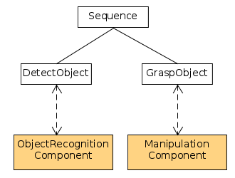
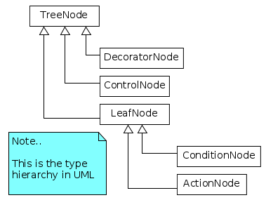
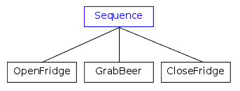
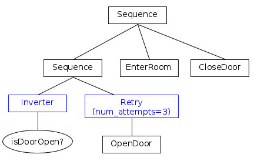
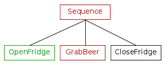
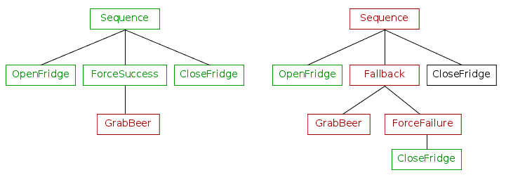
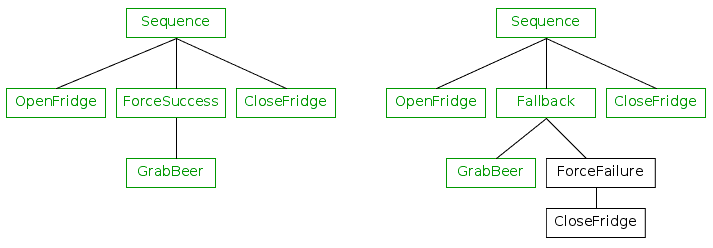

# Introduction to BTs

Unlike a Finite State Machine, a Behaviour Tree is a __tree of hierarchical nodes__ 
that controls the flow of decision and the execution of "tasks" or, as we
will call them further, "__Actions__".

The __leaves__ of the tree are the actual commands, i.e. the place where
our coordinating component interacts with the rest of the system.

For instance, in a service-oriented architecture, the leaves would contain
the "client" code that communicate with the "server" that performs the
operation.

In the following example, we can see two Actions executed in a sequence,
`DetectObject` and `GraspObject`.

The other nodes of the tree, those which are __not leaves__, control the 
"flow of execution".

To better understand how this control flow takes place , imagine a signal 
called "__tick__"; it is executed at the __root__ of the tree and it propagates 
through the branches until it reaches one or multiple leaves.

!!! Note
    The word __tick__ will be often used as a *verb* (to tick / to be ticked) and it means
    
    "To invoke the callback `tick()` called of a `TreeNode`".

Then a `TreeNode` is ticked, it returns a `NodeStatus` that can be either:

- __SUCCESS__
- __FAILURE__
- __RUNNING__
- __IDLE__

The first two, as their names suggest, inform their parent that their operation
 was a success or a failure.

RUNNING is returned by asynchronous nodes when their execution is not completed
and they needs more time to return a valid result.

This C++ library provides also the status __IDLE__; it means that the node is ready to
start.

The result of a node is propagated back to its parent, that will decide
which child should be ticked next or will return a result to its own parent.

## Types of nodes

__ControlNodes__ are nodes which can have 1 to N children. Once a tick
is received, this tick may be propagated to one or more of the children.

__DecoratorNodes__ is similar to the ControlNode, but it can have only a single child. 

__ActionNodes__ are leaves and do not have children. The user should implement
their own ActionNodes to perform the actual task.

__ConditionNodes__ are equivalent to ActionNodes, but
they are always atomic, i.e. they must not return RUNNING. They should not 
alter the state of the system.

## Examples

To better understand how a BehaviorTrees work, let's focus on some practical
examples. For the sake of simplicity we will not take into account what happens
when an action returns RUNNING.

We will assume that each Action is executed atomically and synchronously.

### First ControlNode: Sequence

Let's illustrate how a BT works using the most basic and frequently used 
ControlNode: the [SequenceNode](SequenceNode.md).

The children of a ControlNode are always __ordered__; it is up to the ControlNode
to consider this order or not.

In the graphical representation, the order of execution is __from left to right__.

In short:

- If a child returns SUCCESS, tick the next one.
- If a child returns FAILURE, then no more children are ticked and the Sequence returns FAILURE.
- If __all__ the children return SUCCESS, then the Sequence returns SUCCESS too.

!!! warning "Have you spotted the bug?"
    If the action __GrabBeer__ fails, the door of the 
    fridge would remain open, since the last action __CloseFridge__ is skipped.

### Decorators

The goal of a [DecoratorNode](DecoratorNode.md) is either to transform the result it received 
from the child, to terminate the child, 
or repeat ticking of the child, depending on the type of Decorator.

You can create your own Decorators.

The node __Inverter__ is a Decorator that inverts 
the result returned by its child; Inverter followed by the node called
__DoorOpen__ is therefore equivalent to 

    "Is the door closed?".

The node __Retry__ will repeat ticking the child up to N times (3 in this case)
if the child returns FAILURE.

__Apparently__, the branch on the right side means: 

    If the door is closed, then try to open it.
    Try up to 3 times, otherwise give up and return FAILURE.
    
But...
    
!!! warning "Have you spotted the bug?"
    If __DoorOpen__ returns FAILURE, we have the desired behaviour.
    But if it returns SUCCESS, the left branch fails and the entire Sequence
    is interrupted.
    
    We will see later how we can improve this tree. 
    

### Second ControlNode: Fallback

[FallbackNodes](FallbackNode.md), known also as __"Selector"__,
are nodes that can express, as the name suggests, fallback strategies, 
ie. what to do next if a child returns FAILURE.

In short, it ticks the children in order and:

- If a child returns FAILURE, tick the next one.
- If a child returns SUCCESS, then no more children are ticked and the Fallback returns SUCCESS.
- If all the children return FAILURE, then the Fallback returns FAILURE too.

In the next example, you can see how Sequence and Fallbacks can be combined:
    
  

> Is the door open?
>
> If not, try to open the door.
>
> Otherwise, if you have a key, unlock and open the door.
>
> Otherwise, smash the door. 
>
> If __any__ of these actions succeeded, then enter the room.

### "Fetch me a beer" revisited

We can now improve the "Fetch Me a Beer" example, which left the door open 
if the beer was not inside the fridge.

We use the color "green" to represent nodes which return
SUCCESS and "red" for those which return FAILURE. Black nodes are never executed. 

Let's create an alternative tree that closes the door even when __GrabBeer__ 
returns FAILURE.

Both these trees will close the door of the fridge, eventually, but:

- the tree on the __left__ side will always return SUCCESS if we managed to
 open and close the fridge.
 
- the tree on the __right__ side will return SUCCESS if the beer was there, 
FAILURE otherwise.

Everything works as expected if __GrabBeer__ returns SUCCESS.

