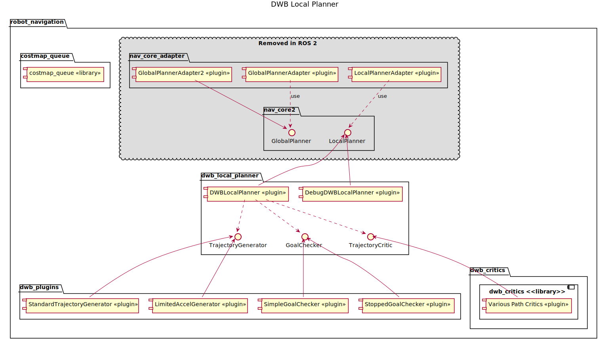

# Local Planner

## Local Planner under ROS 1

Under ROS 1, the navigation stack provides a `BaseLocalPlanner` interface
used by `MoveBase`. The `BaseLocalPlanner` component is expected to take a path and current position and produce a command velocity. The most commonly used implementation of the local planner uses the DWA algorithm, however, the Trajectory Rollout algorithm is also available in the ROS 1 navigation stack.

The navigation repository provides two implementations of the DWA algorithm: `base_local_planner` and `dwa_local_planner`. In addition, there is another DWA based planner in the [Robot Navigation repository](https://github.com/locusrobotics/robot_navigation) called DWB. The `dwa_local_planner` was meant to replace `base_local_planner` and provides a better DWA algorithm, but failed to
provide the Trajectory Rollout algorithm, so was unable to completely replace
`base_local_planner`.

DWB was meant to replace both the planners in the navigation repository and provides
an implementation of both DWA and Trajectory Rollout.

## Migrating to ROS 2

Rather than continue with 3 overlapping implementations of DWA, the DWB planner
was chosen to use as the default controller plugin.

The advantages of DWB were:
* it was designed with backwards compatibility with the other controllers
* it was designed with clear extension points and modularity

## Changes to DWB

For the most part, the DWB codebase is unchanged, other than what was required for ROS2.

The main architectural change is due to the replacement of `MoveBase` by the `FollowPath` action server that uses this plugin.

## New local planner interface

See `nav2_core` `Controller` interface. They are loaded into the `nav2_controller_server` to compute control commands from requests to the ROS2 action server.
